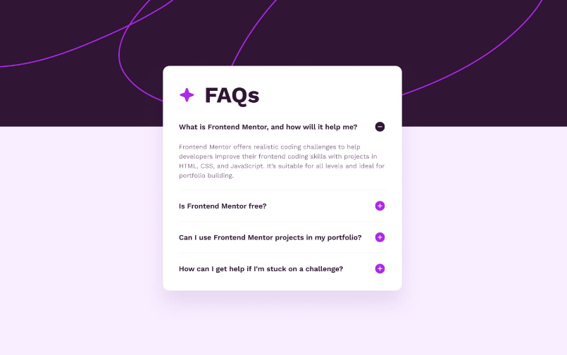
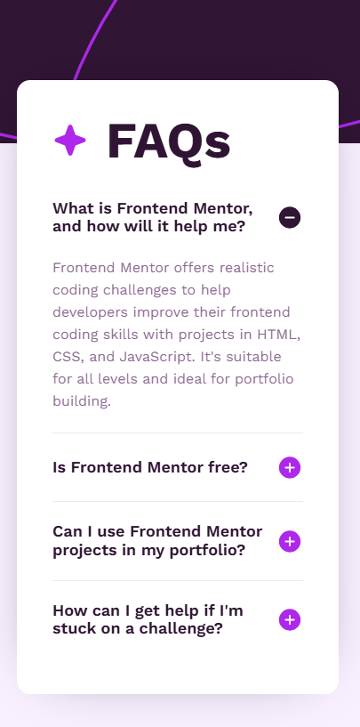

# Frontend Mentor - FAQ accordion solution

This is a solution to the [FAQ accordion challenge on Frontend Mentor](https://www.frontendmentor.io/challenges/faq-accordion-wyfFdeBwBz). Frontend Mentor challenges help you improve your coding skills by building realistic projects. 

## Table of contents

- [Frontend Mentor - FAQ accordion solution](#frontend-mentor---faq-accordion-solution)
  - [Table of contents](#table-of-contents)
  - [Overview](#overview)
    - [The challenge](#the-challenge)
    - [Screenshot](#screenshot)
    - [Links](#links)
  - [My process](#my-process)
    - [Built with](#built-with)
    - [What I learned](#what-i-learned)
  - [Author](#author)


## Overview

### The challenge

Users should be able to:

- Hide/Show the answer to a question when the question is clicked
- Navigate the questions and hide/show answers using keyboard navigation alone
- View the optimal layout for the interface depending on their device's screen size
- See hover and focus states for all interactive elements on the page

### Screenshot






### Links

- Solution URL: [Github](https://github.com/Dllanw/faq-accordion-main))♟️
- Live Site URL: [Netlify](https://faq-accordion-dllanw.netlify.app/)

## My process

### Built with

- Semantic HTML5 markup
- CSS custom properties
- Flexbox
- JavaScript
- @media


### What I learned


```javaScript
img.forEach((imagen) => {
    imagen.addEventListener("mouseenter", (e) => {
      const select = e.target;
      const containerImg = select.closest(".btn-img");
      containerImg.classList.add("btn-img_width");
    });
    imagen.addEventListener("mouseleave", (e) => {
      const select = e.target;
      const containerImg = select.closest(".btn-img");
      containerImg.classList.remove("btn-img_width");
    });
  });
```

## Author

- Website - in progress...🌱
- Frontend Mentor - [@Dllanw](https://www.frontendmentor.io/profile/Dllanw)